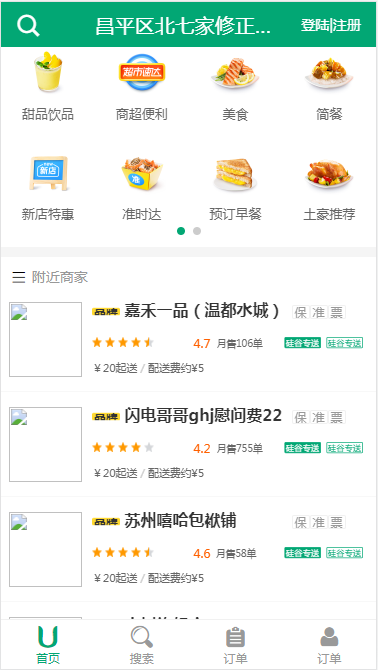
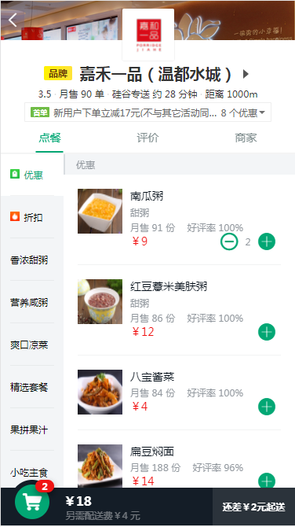
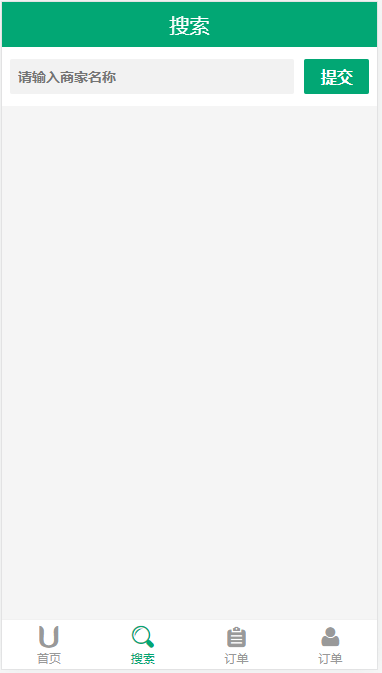
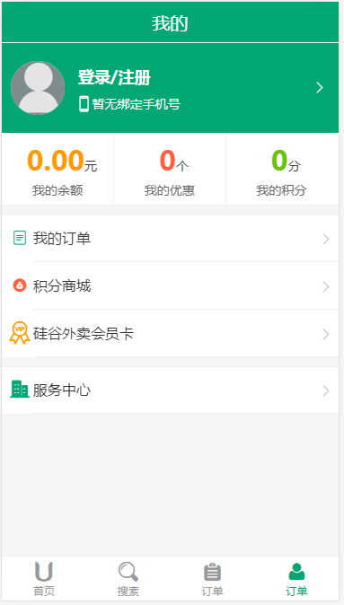
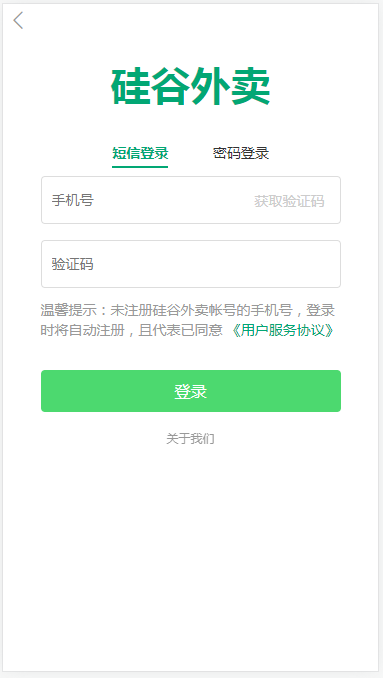

# gshop

> A Vue.js project

## Build Setup

``` bash
# install dependencies
npm install

# serve with hot reload at localhost:8080
npm run dev

# build for production with minification
npm run build

# build for production and view the bundle analyzer report
npm run build --report
```

调用后端接口进行数据展示，因为后端接口的商家图片链接失效了，所以图片加载不出来



商家细节页面，用到better-scroll优化滚动效果




登录方式可以为手机验证码、用户名



